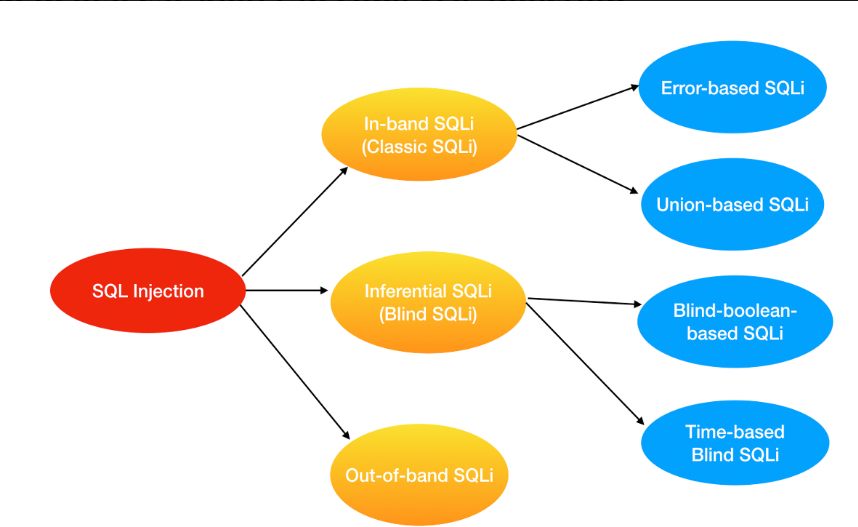
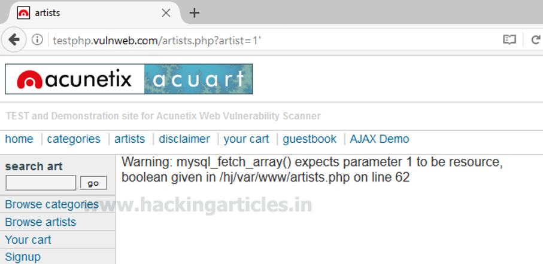
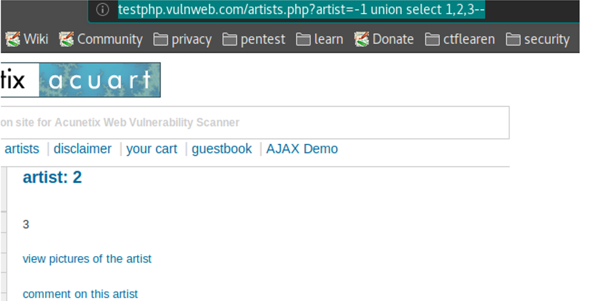
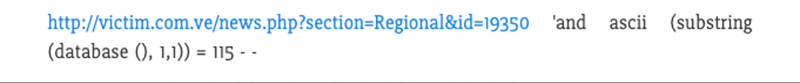

# Summary SQLi

### Contents
- [Khái niệm SQLi](https://github.com/chi442000/SQLi#Concept)
- [Nguyên nhân](https://github.com/chi442000/SQLi#reason)
- [Mức độ nguy hiểm ](https://github.com/chi442000/SQLi#dangerousness)
- [Các loại tấn công SQLi](https://github.com/chi442000/SQLi#types-of-attacks)
    - [In-band SQLi](https://github.com/chi442000/SQLi#In-band-SQLi)
    - [Inferential SQLi (Blind SQLi)](https://github.com/chi442000/SQLi#Inferential-SQLi-(Blind-SQLi))
    - [Out-of-band SQLi](https://github.com/chi442000/SQLi#out-of-band-sqli)
- [Các phòng chống SQLi](https://github.com/chi442000/SQLi#prevention)
- [Kết luận](https://github.com/chi442000/XSS#in-conclusion)

### Concept
- SQL Injection là một kỹ thuật cho phép những kẻ tấn công lợi dụng lỗ hổng của việc kiểm tra dữ liệu đầu vào trong các ứng dụng web và các thông báo lỗi của hệ quản trị cơ sở dữ liệu trả về để inject (tiêm vào) và thi hành các câu lệnh SQL bất hợp pháp
- SQL injection có thể cho phép những kẻ tấn công thực hiện các thao tác trên cơ sở dữ liệu của ứng dụng, thậm chí là server mà ứng dụng đó đang chạy.

### Reason
 
- Dữ liệu đầu vào từ người dùng hoặc từ các nguồn khác không được kiểm tra hoặc kiểm tra không kỹ lưỡng
- Ứng dụng sử dụng các câu lệnh SQL động, trong đó dữ liệu được kết nối với mã SQL gốc để tạo câu lệnh SQL hoàn chỉnh

### Dangerousness

Tùy vào mức độ tinh vi, SQL Injection có thể cho phép kẻ tấn công:

- Vượt qua các khâu xác thực người dùng
- Chèn, xóa hoặc sửa đổi dữ liệu
- Đánh cắp các thông tin trong CSDL
- Chiếm quyền điều khiển hệ thống

### Types of Attacks
Phân loại các kiểu tấn công SQL Injection

SQL Injection có thể chia nhỏ thành các dạng sau:

- In-band SQLi

Error-based SQLi

Union-based SQLi
- Inferential SQLi (Blind SQLi)

Blind-boolean-based SQLi

Time-based-blind SQLi
- Out-of-band SQLi

#### **In-band SQLi**

Đây là dạng tấn công phổ biến nhất và cũng dễ để khai thác lỗ hổng SQL Injection nhất
Xảy ra khi hacker có thể tổ chức tấn công và thu thập kết quả trực tiếp trên cùng một kênh liên lạc
In-Band SQLi chia làm 2 loại chính:
- Error-based SQLi
- Union-based SQLi

*Error-based SQLi*
- Là một kỹ thuật tấn công SQL Injection dựa vào thông báo lỗi được trả về từ Database Server có chứa thông tin về cấu trúc của cơ sở dữ liệu.
- Trong một vài trường hợp, chỉ một mình Error-based là đủ cho hacker có thể liệt kê được các thuộc tính của cơ sở dữ liệu

*Union-based SQLi*

Là một kỹ thuật tấn công SQL Injection dựa vào sức mạnh của toán tử UNION trong ngôn ngữ SQL cho phép tổng hợp kết quả của 2 hay nhiều câu truy vấn SELECTION trong cùng 1 kết quả và được trả về như một phần của HTTP response

#### Inferential SQLi( Blind SQLi)

- Không giống như In-band SQLi, Inferential SQL Injection tốn nhiều thời gian hơn cho việc tấn công do không có bất kì dữ liệu nào được thực sự trả về thông qua web application và hacker thì không thể theo dõi kết quả trực tiếp như kiểu tấn công In-band
- Thay vào đó, kẻ tấn công sẽ cố gắng xây dựng lại cấu trúc cơ sở dữ liệu bằng việc gửi đi các payloads, dựa vào kết quả phản hồi của web application và kết quả hành vi của database server.
- Có 2 dạng tấn công chính:

*Blind-boolean-based*

*Blind-time-based SQLi*

**Blind-boolean-based**

- Là kĩ thuật tấn công SQL Injection dựa vào việc gửi các truy vấn tới cơ sở dữ liệu bắt buộc ứng dụng trả về các kết quả khác nhau phụ thuộc vào câu truy vấn là True hay False.
- Tuỳ thuộc kết quả trả về của câu truy vấn mà HTTP reponse có thể thay đổi, hoặc giữ nguyên
- Kiểu tấn công này thường chậm (đặc biệt với cơ sở dữ liệu có kích thước lớn) do người tấn công cần phải liệt kê từng dữ liệu, hoặc mò từng kí tự

**Time-based Blind SQLi**
- Time-base Blind SQLi là kĩ thuật tấn công dựa vào việc gửi những câu truy vấn tới cơ sở dữ liệu và buộc cơ sở dữ liệu phải chờ một khoảng thời gian (thường tính bằng giây) trước khi phản hồi.
- Thời gian phản hồi (ngay lập tức hay trễ theo khoảng thời gian được set) cho phép kẻ tấn công suy đoán kết quả truy vấn là TRUE hay FALSE
- Kiểu tấn công này cũng tốn nhiều thời gian tương tự như Boolean-based SQLi

#### Out-of-band SQLi

- Out-of-band SQLi không phải dạng tấn công phổ biến, chủ yếu bởi vì nó phụ thuộc vào các tính năng được bật trên Database Server được sở dụng bởi Web Application.
- Kiểu tấn công này xảy ra khi hacker không thể trực tiếp tấn công và thu thập kết quả trực tiếp trên cùng một kênh (In-band SQLi), và đặc biệt là việc phản hồi từ server là không ổn định
- Kiểu tấn công này phụ thuộc vào khả năng server thực hiện các request DNS hoặc HTTP để chuyển dữ liệu cho kẻ tấn công.
- Ví dụ như câu lệnh xp_dirtree trên Microsoft SQL Server có thể sử dụng để thực hiện DNS request tới một server khác do kẻ tấn công kiểm soát, hoặc Oracle Database’s UTL HTTP Package có thể sử dụng để gửi HTTP request từ SQL và PL/SQL tới server do kẻ tấn công làm chủ

### Prevention 

Mặc dù SQL rất nguy hại nhưng cũng dễ phòng chống. Gần đây, hầu như chúng ta ít viết SQL thuần mà toàn sử dụng ORM (Object-Relational Mapping) framework. Các framework web này sẽ tự tạo câu lệnh SQL nên hacker cũng khó tấn công hơn.

Tuy nhiên, có rất nhiều site vẫn sử dụng SQL thuần để truy cập dữ liệu. Đây chính là mồi ngon cho hacker. Để bảo vệ bản thân trước SQL Injection, ta có thể thực hiện các biện pháp sau.

- Lọc dữ liệu từ người dùng: Cách phòng chống này tương tự như XSS. Ta sử dụng filter để lọc các kí tự đặc biệt (; ” ‘) hoặc các từ khoá (SELECT, UNION) do người dùng nhập vào. Nên sử dụng thư viện/function được cung cấp bởi framework. Viết lại từ đầu vừa tốn thời gian vừa dễ sơ sót.
- Không cộng chuỗi để tạo SQL: Sử dụng parameter thay vì cộng chuỗi. Nếu dữ liệu truyền vào không hợp pháp, SQL Engine sẽ tự động báo lỗi, ta không cần dùng code để check.
- Không hiển thị exception, message lỗi: Hacker dựa vào message lỗi để tìm ra cấu trúc database. Khi có lỗi, ta chỉ hiện thông báo lỗi chứ đừng hiển thị đầy đủ thông tin về lỗi, tránh hacker lợi dụng.
- Phân quyền rõ ràng trong DB: Nếu chỉ truy cập dữ liệu từ một số bảng, hãy tạo một account trong DB, gán quyền truy cập cho account đó chứ đừng dùng account root hay sa. Lúc này, dù hacker có inject được sql cũng không thể đọc dữ liệu từ các bảng chính, sửa hay xoá dữ liệu.
- Backup dữ liệu thường xuyên: Các cụ có câu “cẩn tắc vô áy náy”. Dữ liệu phải thường xuyên được backup để nếu có bị hacker xoá thì ta vẫn có thể khôi phục được. Còn nếu cả dữ liệu backup cũng bị xoá luôn thì … chúc mừng bạn, update CV rồi tìm cách chuyển công ty thôi!
Mặc dù loại tấn công này được coi là một trong những loại nguy hiểm và rủi ro nhất, nhưng vẫn nên chuẩn bị một kế hoạch ngăn ngừa. Bởi vì sự phổ biến của cuộc tấn công này, có khá nhiều cách để ngăn chặn nó.

###  In conclusion

